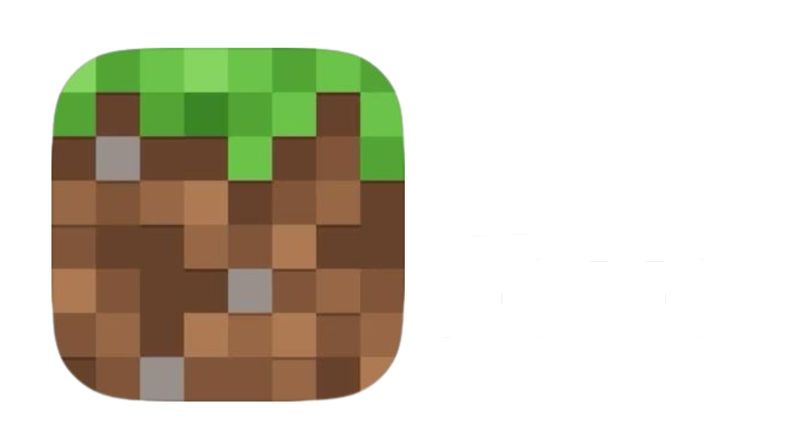

  

Fork of [PolyMC](https://github.com/PolyMC/PolyMC) And the Themes are from PrismLauncher (not the Windows 7 Aero) This project is independent and is **not affiliated with or endorsed by Prism Launcher, PolyMC, Mojang Studios, or Microsoft**.

## Download

Get the latest release from the **Releases** page of this repository.

> [!WARNING]
> Offline accounts **cannot** join premium (online-mode) Minecraft servers such as Hypixel, DonutSMP, or any other server that requires a valid Microsoft/Minecraft account. To access those servers, you must own an official copy of Minecraft.
